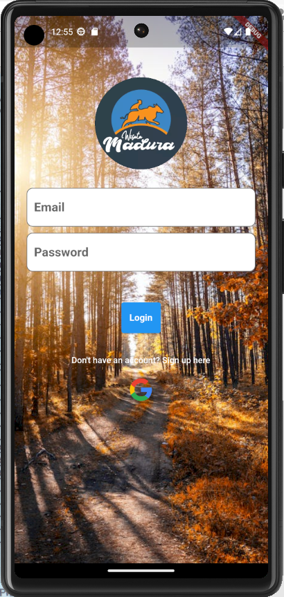
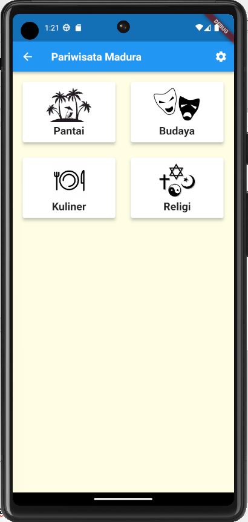
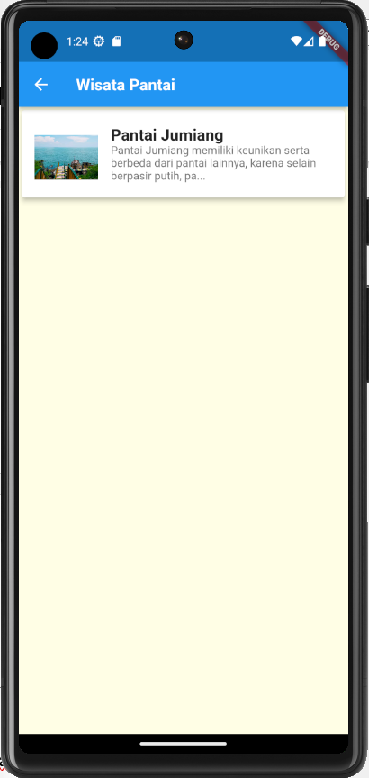
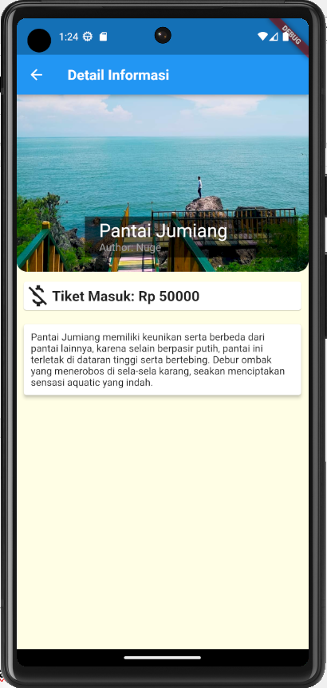

# PROJECT-MOBILE-2023- PARIWISATA MADURA
# Nama: Abd Ghafur
# Nim : 2131750001
# ---------------------------------
Deskripsi:Aplikasi Ini membantu untuk pengunjung dari luar madura ataupun dalam madura untuk mencari wisata yang indah di dalam pulau madura
# ---------------------------------
# Cara Running Aplikasi

## Halaman Pertama
## Login
## Memasukkan Akun yang sudah di daftrakan , kalau belum ada akun melakukan sign up terlebih dahulu

## Halaman Kedua
## yaitu berisi 4 hal parwisata Di Madura

## Halaman Ketiga yaitu ketika meng klik wisata pantai maka akan diarahkan ap saja pantai yang ada di madura

## Detail Screen

A few resources to get you started if this is your first Flutter project:

- [Lab: Write your first Flutter app](https://docs.flutter.dev/get-started/codelab)
- [Cookbook: Useful Flutter samples](https://docs.flutter.dev/cookbook)

For help getting started with Flutter development, view the
[online documentation](https://docs.flutter.dev/), which offers tutorials,
samples, guidance on mobile development, and a full API reference.
